# Data Analysis and Decision Making

 
 

  

 
 

  4th Year - Data Analysis - 2025

 

  Alexandre Gazagnes

---

## 1. Introduction to  -- *REAL* -- Data Analysis

### 1.1 A Brief History of the Data Revolution

#### 1.1.1 From Writing to the Internet

---

1. **Writing Invention - Mesopotamia**: The earliest form of data recording—cuneiform tablets used to track trade, taxes, and inventories.

  

---

2. **Gutenberg’s Printing Press**: Made books accessible, empowering the spread of knowledge and enhancing religious and political influence.

  

---

3. **Telegraph / Phone**: Instant communication across distances revolutionized commerce and personal connectivity. 

  

---

4. **The Internet**: The advent of websites, email, and social media made data ubiquitous, driving modern global 
communication and business.

  

---

#### 1.1.2 Data as a Source of Power and Wealth

- **Data → Insight → Decision → Value**:
   - Analyze situations and options.
   - Make informed decisions.
   - Drive actions that generate power and wealth.

   ---

- **The Double-Edged Sword**:
   - Wrong data can lead to successful outcomes by luck.
   - Good data and analysis might fail due to unforeseen circumstances.

---

#### 1.1.3 Short Stories from Data History

1. **Mesopotamian Trade Records**: Early accounting systems to track wealth.

  

---

2. **Domesday Book (England)**: Commissioned by William the Conqueror to assess land and taxes.

  

--- 

3. **Nurse in Wartime**: Florence Nightingale’s use of data visualization to highlight sanitary conditions over battlefield injuries.

  

--- 

4. **London Cholera Epidemic**: John Snow’s mapping of cholera clusters linked to contaminated water sources.

  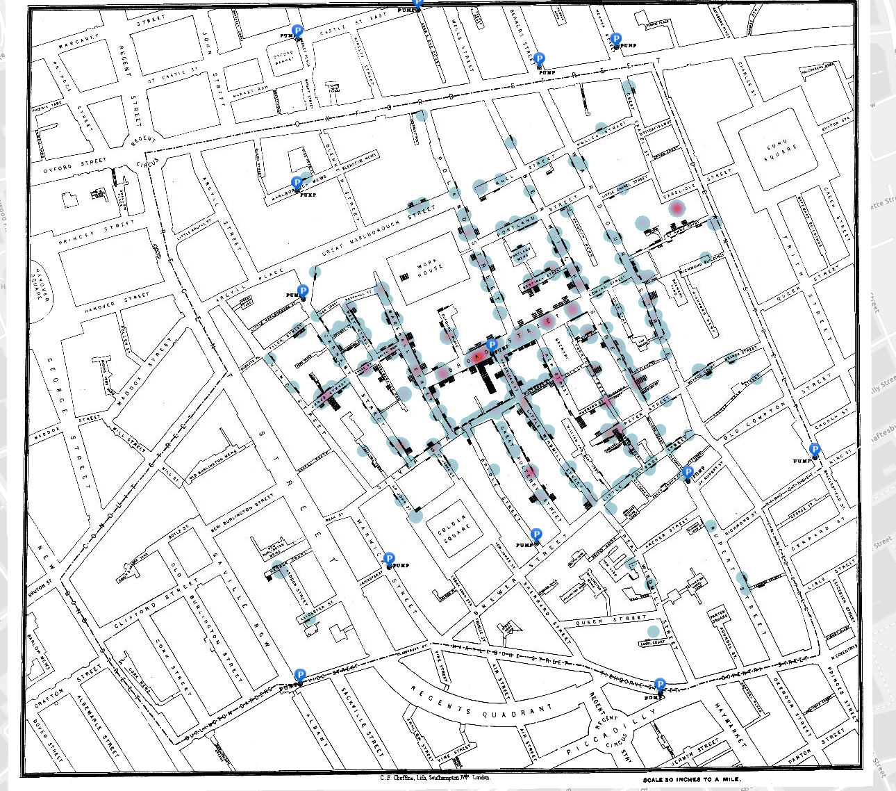

---

## 1.2 Misinterpretations of Data

#### 1.2.1 WWII Plane Armor

  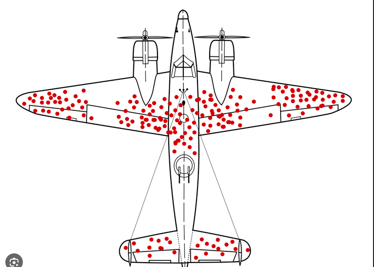

---
 
 
 

- Observing bullet holes on returning planes led to the assumption armor should be placed there.

- **The Insight**: Focus on parts where planes didn’t sustain damage but were still crucial to survival—the non-returned planes provided key missing data.

---

#### 1.2.2 Being Fooled by Data:
- Common cognitive biases:
   - **Confirmation Bias**: Seeking data that confirms existing beliefs.
   - **Availability Heuristic**: Overvaluing easily accessible information.
   - **Survivorship Bias**: Focusing on successful outcomes while ignoring failures.
   - **Loss Aversion**: Overvaluing potential losses over gains.
   - **Sunk Cost Fallacy**: Justifying continued investment in a failing endeavor.
   - **Anchoring**: Relying too heavily on the first piece of information.

---

#### 1.2.3 Occam's Razor:

 
 

  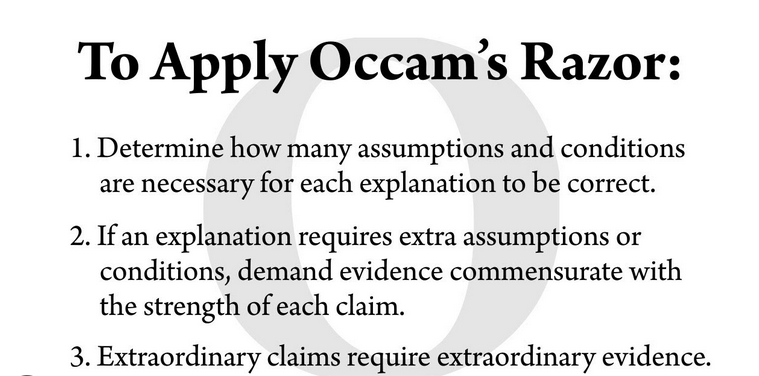

---

 
 
 

- "The simplest explanation is usually the best." MISSUNDERSTOOD 
- Be cautious of convoluted interpretations.
- Simplest theory are always easiest to refute 

---

#### 1.2.4 Spurious Correlations and Hidden Variables

  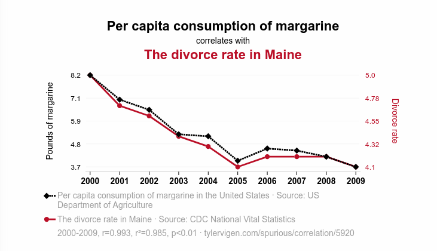

 

https://www.tylervigen.com/spurious-correlations

---

 
 
 

Correlation but no causation 

 

Correlation but no causation 

 

Correlation but no causation 

<!-- --- -->

<!-- #### Example 2: Smoking and Speed

- Data suggested smokers are faster, but the hidden variable was **age** (younger individuals smoked more and were faster).
- Other hidden variables include gender, socioeconomic status, and education. -->

---

#### 1.2.5 Famous Data Misunderstanding

 
 

  

--- 

* A shark attack in a small town.
* Mayor worried about the business.
* Major operation to kill **THE** shark, Shark was killed! 
* Mayor says "We're done with **THE** shark"
* Scientist says "We're not done with **THE** shark, We're done  with **ONE** shark"
* Mayor says "Come on, fool, stop with your science, we killed **THE** shark."
* Scientist says, let me show you **THE** data, we're not done with **THE** shark, we're done with **ONE** shark"

---

### 1.3 Living in a Post-Truth World

#### 1.3.1 Somes stories false but not critical

  

  

--- 

#### 1.3.2 Somes stories false and critical

 

    

--- 

50% of the population at least "not" sure in US Gen Z

  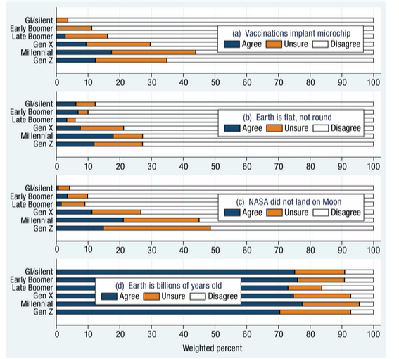

---

### 1.3.3 Somes "conspiracies" are true 

Colin Powell, 2003, UN, Iraq, blufing as pro poker player : 

 
 

  

--- 

### 1.3.4 New challenges for everyone

 
 
   
- Where is THE truth ?

- AI-generated videos and audio clips can manipulate reality.

- Tons of short videos, generated by IA with huge click rate

- Governmentals Secrets Services farms to generate fake news and manipulate public opinion

---

### 1.4 Conclusion
 
 
By understanding the power of data, historical lessons, and the risks of misinterpretation, we can develop a more informed, critical approach to decision-making in a data-driven world.

---

## 2. Not so Basic Reminder about Not so Basic Data Analysis

---

### 2.1 Data is not about mean, IQ or stat test?

 
 
 

No  
No  
No  
No

---

 

**Data → Insight → Decision → Value**  

 

Think in reverse:

- What is my purpose?
  - Optimizing **n**, finding solutions.
  - Business, money, medical goals.

- What is my problem?
- **What do I know about my problem?**

---

### 2.2 Getting Some Relevant Data

 
 

- What data might/should I want?
- Where to find it?
- What variables could I find (internet/open data/in my company)?
- Is it relevant? Too old? Too many? Trustable? Related?

---

### 2.3 Being Critical with Data

- How many variables are there?
- Can I trust them?

 

Examples:
- User database: someone listed as 198 years old?
- Many users 1750m tall? (Maybe data is in cm?)
- dataset with 95% of missing values?

---

### 2.4 First Look at the Data

#### 2.4.1 Reading the Data

- **Display the Data**:
  - Top 10 rows
  - Last 10 rows
  - Random 10 rows

- **Shape of the Data**
---

 
 

  **Take the time to look at the data**

 
 

  **Let your brain make some inferences (it’s pretty good at this)**

---

#### 2.4.2 Data Types and First Insights

- **Data Types**:
  - Numerical:
    - Continuous
    - Discrete

  - Categorical:
    - Ordinal
    - Cardinal

**Tip**: Convert ordinal categorical data to numerical if needed.

---

### 2.5 Missing Values and Outliers

- **Identify Missing Values**:
  - Count NaN values.
  - Missing values (%) by row/column.

- **Examine Outliers**:
  - Min / Max values.
  - Use summary stats and visualizations:
    - Mean / Standard Deviation / Density Function
    - Median / IQR / Box Plots

---

### 2.6 Preparing / cleaning the data

* Drop columns / lines with too many missing values
* Select subset of columns / lines with relevant data for  your analysis
* Fill missing values with mean, median, mode, or other values if relevant
* Transform categorical ordinal data into numerical data if relevant
* Apply log, square root, or other transformations to numerical data if relevant
* Remove outliers if relevant
* Create new columns if relevant

--- 

### 2.7 Univariate Analysis

#### 2.7.1 Numerical Data

- Descriptive statistics.
    - Mean / Standard Deviation / Density Function
    - Median / IQR / Box Plots

 
 
 

**Difference between mean and median?**

---

  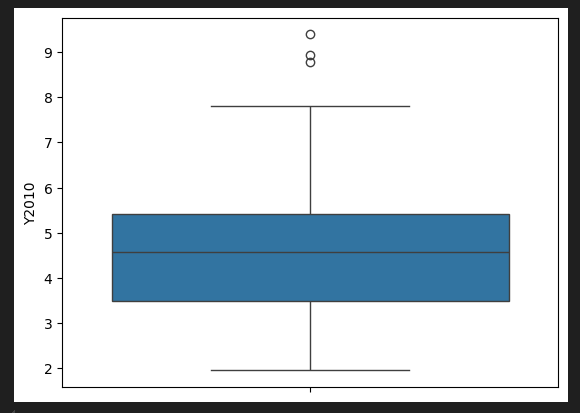

- Graphs:
  - Box Plots
  - Density Distributions

---

### 2.7.2 Categorical Data

- Descriptive statistics.
  - Count of categories.
  - Percentages per category.

- Graphs:
  - Bar Plot
  - Pie Chart

---

### 2.8 Bivariate/Muli-variate Analysis

### 2.8.1 Bivariate Analysis

- **Numerical vs. Numerical**:
  - Scatter Plots
  - Correlation Coefficient

- **Categorical vs. Numerical**:
    - Box Plots
    - Violin Plots
    - ANOVA

---

- **Categorical vs. Categorical**:
    - Contingency Tables
    - Chi-Square Test

  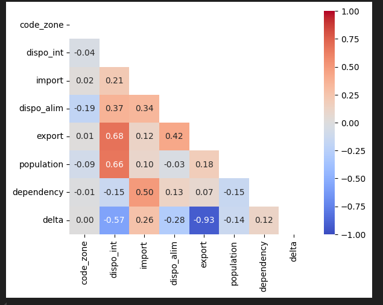

---

### 2.8.2 Multi variate analysis

Correlation matrix : 
* Heatmap
* Scatter plot matrix

Question to ask :

- What are the most correlated variables ?
- What does that mean to  have 2 variables very highly correlated ?
- What not so easy to interpret variables do  we have ?

---

## 3. Grouping Data & dimensions

--- 

### 3.1 Curse of dimentionality

In data : 
* More columns = more data = more information
* More columns = more data = more noise

**The more columns you have, the more difficult it is to find the signal in the noise**

Data selection is key to avoid the curse of dimentionality

--- 

Having 100 or 1000 columns is a garantee of having a good dataset ! 

 
 

  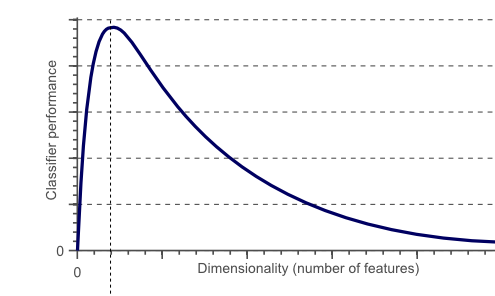   

Do you really need all of them ?

---

## 3.2 Main ideas behind Grouping Data & dimensions

1. **Reduces Complexity**

    High-dimensional data can be difficult to analyze due to the "curse of dimensionality." Reducing dimensions simplifies data, making it easier to understand and process.

2. **Enhances Visualization**

    Dimensionality reduction techniques like PCA (Principal Component Analysis) or t-SNE reduce data to 2D or 3D, enabling visualization of complex datasets.

---

3. **Facilitates Interpretability** 

    A dataset with fewer dimensions is easier to interpret and analyze. It highlights the most important variables contributing to the underlying patterns.

3. **Improves Performance**

    Algorithms like clustering, regression, or classification perform faster on lower-dimensional data. Computational efficiency increases, especially for machine learning models.

--- 

 

**Grouping Data & dimensions  : 2 main techniques** 

 

- Reducing the number of columns ==> ACP /PCA : Principal Component Analysis

 

- Reducing the number of lines  ==> clustering : K-means / DBSCAN / Hierarchical clustering

---

### Grouping the columns with Principal Component Analysis 

- **ACP /PCA : Principal Component Analysis**

    - **Goal**: Reduce the number of dimensions while retaining the most important information.
    - **Method**: Linear transformation to create new uncorrelated variables (principal components).
    - **Applications**: Data visualization, noise reduction, feature extraction, and data compression.

--- 

**Process** 

* Prepare the  data by  standardizing it.
* Computing Explain variance ratio.
* Selecting the number of components.
* Computing new synthetic variables.
* Interpreting the new synthetic variables.
* Transforming the data.
* Projetcion of the  data in the new synthetic variables.
* Analysing the results.

---

Raw data : 

 

  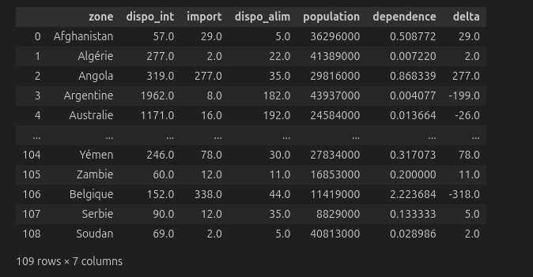

---

Standardized data :

  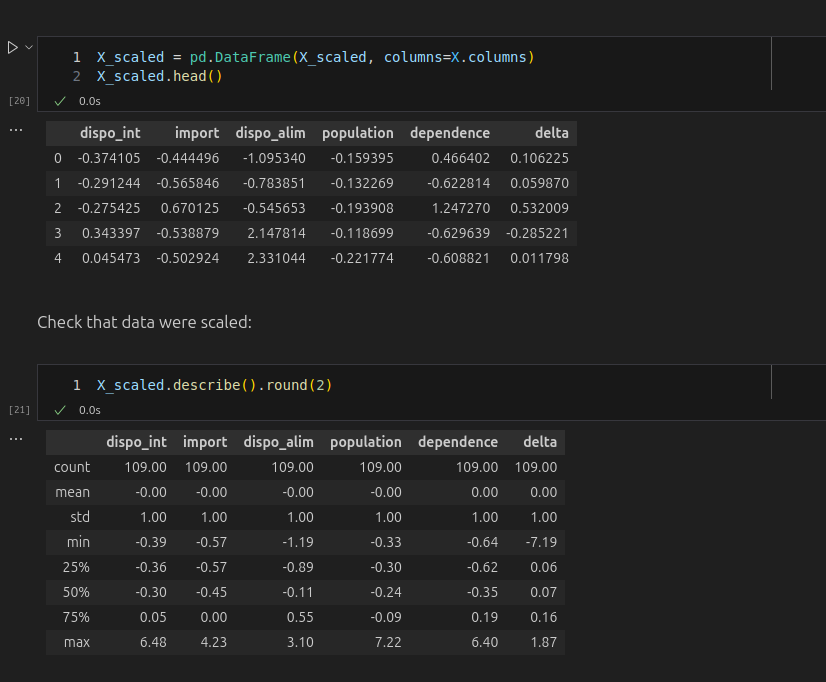

---

New dimensions : 

 

  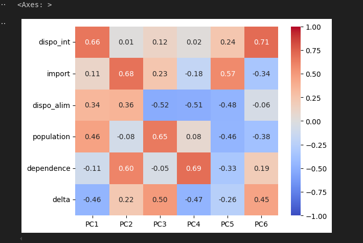

---

Explained variance ratio : 

 

  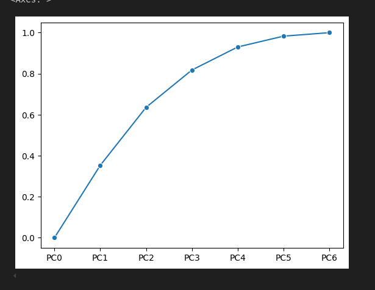

--- 

Correlation between the new dimensions and the old ones :

 

  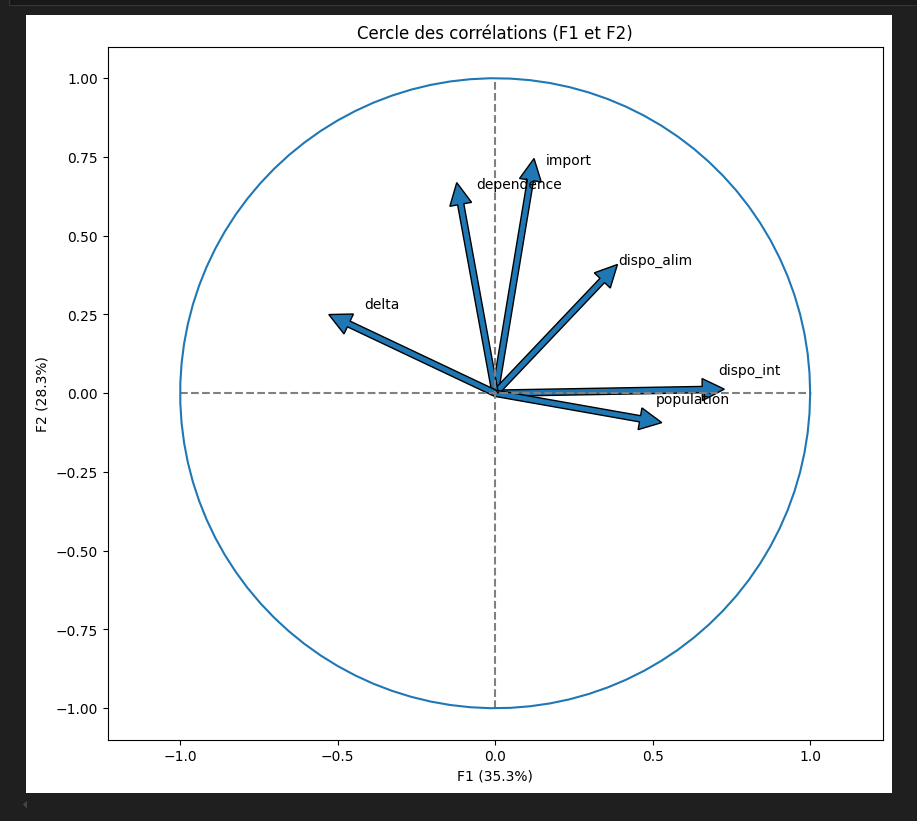

---

Projection of the data in the new dimensions :

 

  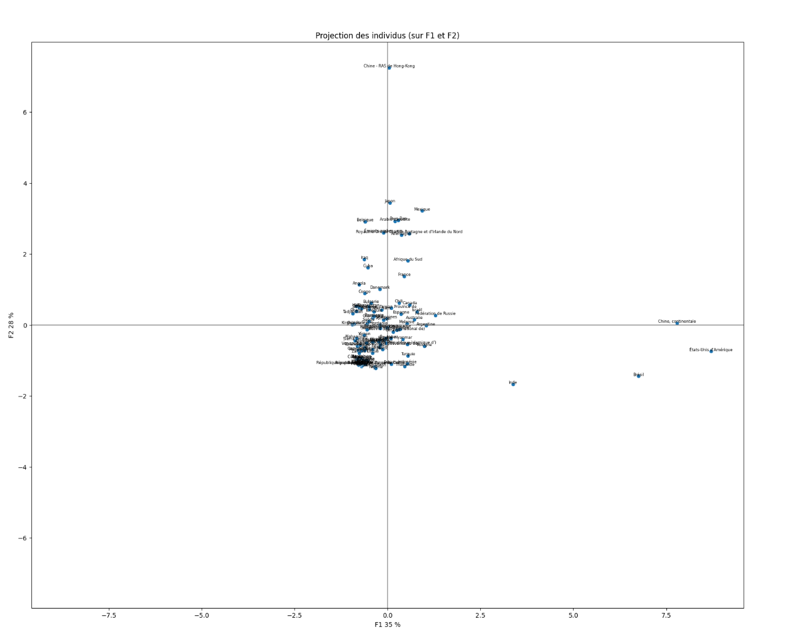

--- 

### Grouping the lines with clustering : K-Means

- **K-means** 

    - **Goal** : Group data points into clusters based on similarity, minimizing the variance within each cluster.
    
    - **Method** : Iteratively assigns data points to the nearest cluster centroid and updates centroids to minimize within-cluster variance.
    
    - **Applications** : Customer segmentation, anomaly detection, pattern recognition, and document clustering.

--- 

**Process**

* Prepare the data by normalizing or scaling it.
* Choose the number of clusters (k) based on prior knowledge or methods like the Elbow Method.
* Initialize the centroids randomly or using optimized techniques.
* Assign data points to the nearest centroid using a distance metric.
* Process data until convergence (when centroids no longer change significantly).
* Analyze the results:   Evaluate cluster quality, Plot, Interpret clusters in the context of the problem domain.

---

Running the Kmeans : 

 

  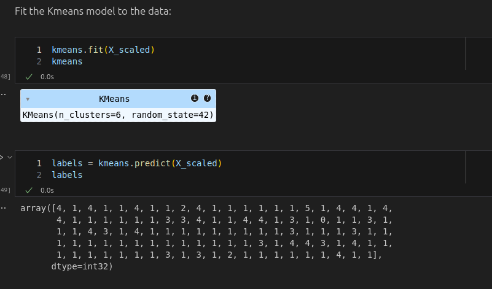

--- 

Assigning letters to  the clusters :

 

  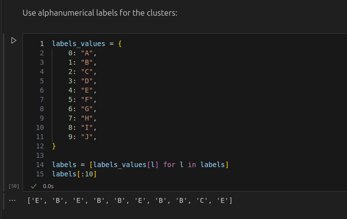

---

Displaying the clusters :

 

  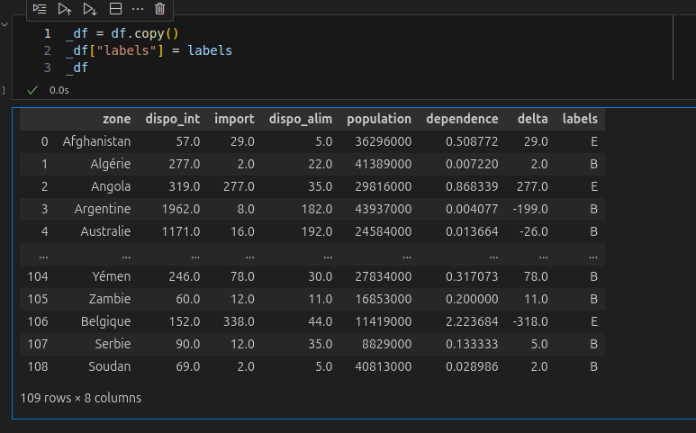

--- 

Using Box plot to evaluate the quality of the clusters :

 

  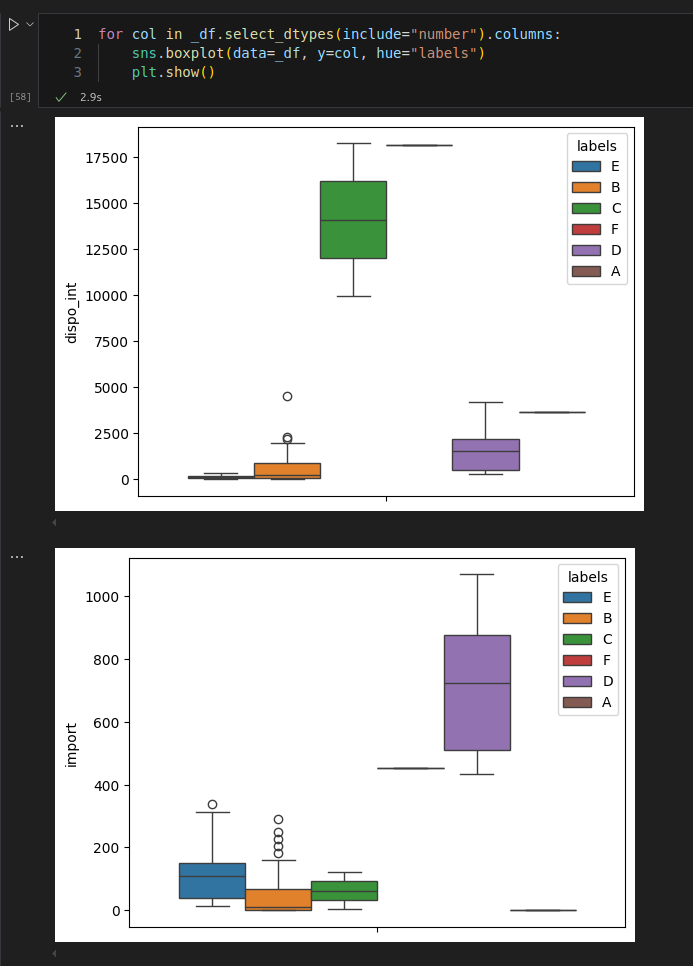

--- 